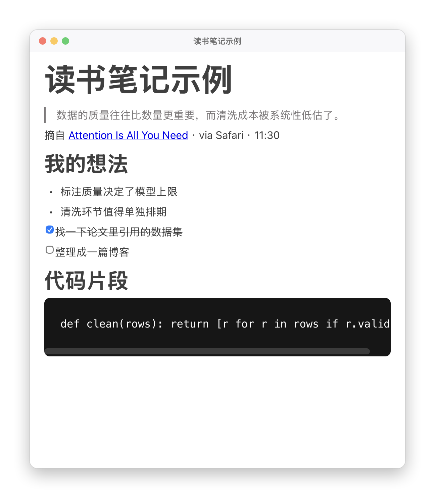

# 悬浮笔记 FloatNotes

> 一个永远浮在所有窗口之上的 macOS 笔记应用。读到什么就选中按一下，笔记自己攒起来，读完了再一起整理。

[English](#english) · [设计文档](docs/调研与设计方案.md) · [技术验证报告](docs/M0技术验证报告.md)

---



## 它解决什么问题

一边读文章一边记笔记，通常只有两条路：分屏，或者不停在窗口之间切。分屏会让阅读区变窄，切窗口会打断思路。

这个应用的做法是把笔记直接浮在最上层。它浮在所有普通窗口之上，也能跟着你进全屏 Space——浏览器全屏看文章、看视频，笔记窗口都不会被盖住。同时点笔记打字**不会把浏览器踢到后台**，你可以一边看着原文一边写。

它还顺手解决了另一个问题：读文章时频繁弹出的窗口本身就是一种打扰。所以划词捕获默认是**静默的**——内容直接存进「今日笔记」，屏幕上只闪一个小胶囊，读完再统一整理归档。

## 特性

**捕获**

- `⌥⌘E` 划词捕获，自动带上选中文字、来源标题、来源 URL 和时间
- 默认静默存入「今日笔记」，只弹一个不抢焦点的提示，不打断阅读
- 也可以切成「每条摘录弹一个新窗口」
- 走 macOS 辅助功能 API 读取选中内容，拿不到时退回模拟 ⌘C 并**还原你原来的剪贴板**

**整理**

- `⌥⌘G` 打开整理视图，把当天攒下的摘录逐条勾选归档
- 归档到已有主题笔记，或现场新建一篇
- 归档是「移动」不是「复制」，今日笔记作为收件箱当天清空
- 归档时自动把日期补进标题，保留来源链接

**编辑**

- 基于 BlockNote 的块编辑器，支持斜杠命令、待办、表格、折叠块
- 粘贴图片自动落盘到附件目录
- 8 种正文字体（苹方 / 宋体 / 楷体 / 圆体 / 等宽…）+ 12–26pt 字号
- 每篇笔记独立的透明度、主题、置顶开关

**其他**

- `⌥⌘K` 全局搜索（标题 + 正文）
- 笔记就是磁盘上的普通 `.md` 文件，可以用 Obsidian / VS Code 直接打开，改动会自动同步回来
- 会话恢复、附件垃圾回收、导出 RTF / 复制为富文本
- 无需 Xcode 即可构建

## 安装

需要 macOS 14 或更高。

```bash
git clone https://github.com/Xinyuan-Gao/floatnotes.git
cd floatnotes
./build.sh
cp -R "dist/悬浮笔记.app" /Applications/
```

首次使用划词捕获时，系统会请求「辅助功能」权限。按提示在「系统偏好设置 › 隐私与安全性 › 辅助功能」里勾选「悬浮笔记」即可。

> 应用是 ad-hoc 签名的，没做公证。如果 Gatekeeper 拦截，执行 `xattr -dr com.apple.quarantine /Applications/悬浮笔记.app`。

## 快捷键

| 快捷键 | 功能 |
|---|---|
| `⌥⌘E` | 划词捕获（存入今日笔记 / 弹窗） |
| `⌥⌘G` | 整理今日笔记 |
| `⌥⌘T` | 打开今日笔记 |
| `⌥⌘K` | 搜索笔记 |
| `⌥⌘N` | 新建空笔记 |
| `⌥⌘H` | 显示 / 隐藏全部笔记 |
| `⌥⌘R` | 全部收起 / 展开 |
| `⌥⌘L` | 切换「盖住菜单栏和程序坞」 |
| `⌥⌘B` | 隐藏 / 显示悬浮球 |

悬浮球可以拖到屏幕任意位置，靠近左右边缘时会自动吸附。双击直接新建笔记。觉得它碍事就按 `⌥⌘B` 收起来，或者右键它选「隐藏悬浮球」——菜单栏里也能切。

## 技术上的几个点

原生外壳 + Web 编辑器的混合架构。窗口行为交给 AppKit，编辑体验交给 BlockNote。

**永远置顶且能进全屏 Space** 靠三行配置：

```swift
panel.level = .floating
panel.collectionBehavior = [.canJoinAllSpaces,
                            .fullScreenAuxiliary,   // 能浮在别的 App 的全屏之上
                            .stationary]
panel.isFloatingPanel = true
```

**点击笔记不抢焦点**靠的是面板的 `.nonactivatingPanel` 样式。这一点和 App 的激活策略互相独立，所以有 Dock 图标 / 纯菜单栏两种形态都不影响它。

**粘贴的图片**通过自定义 URL scheme `floatnotes://` 提供，绕开了 `file://` 下的跨目录读取限制，也不用起本地 HTTP 服务。

**编辑器是单文件 HTML**。React + BlockNote 用 Vite 全部内联进一个 2.6MB 的 `index.html`，WKWebView 直接加载，省掉了 `WKURLSchemeHandler` 之外的全部麻烦。

## 项目结构

```
floatnotes/
├── Sources/FloatNotes/          Swift 源码（20 个文件）
│   ├── NotePanel.swift          置顶面板 / 悬浮球 / 贴边吸附
│   ├── NoteWindowManager.swift  多窗口 / 层级 / 会话恢复
│   ├── SelectionCapture.swift   划词捕获（AX API + 剪贴板兜底）
│   ├── DailyNote.swift          今日笔记
│   ├── DailyNoteTriage.swift    条目解析与归档
│   ├── TriageWindow.swift       整理视图
│   ├── WebEditorView.swift      WKWebView + JS 桥
│   ├── EditorSchemeHandler.swift  floatnotes:// scheme
│   └── ...
├── editor-src/                  BlockNote 编辑器（Vite）
├── tools/                       图标生成与验证
├── docs/                        设计文档与各阶段交付报告
├── build.sh                     一键构建（不需要 Xcode）
└── Info.plist
```

## 开发

```bash
./build.sh                      # 构建 + 打包 .app

# 全链路自检（无需人工，跑完自动退出，exit 0 = 全部通过）
"./dist/悬浮笔记.app/Contents/MacOS/FloatNotes" --selftest

# 重新生成图标
./tools/make-icon.sh
```

自检覆盖十四个阶段：块编辑器往返、图片粘贴链路、外部文件同步、归档流程、字体与字号是否真正生效、多窗口内存量化等。它会打印实际数值而不是简单的通过与否，比如：

```
[selftest] 编辑器计算样式 = {"family":"\"Kaiti SC\", STKaiti, serif","size":"21px"}
[selftest] 内存: 5 窗口 | 基线 61.0 MB | 平均 87.3 MB
[selftest] 归档 2 条 → 自检主题笔记；今日笔记剩 1 条，目标笔记收到 2 条
```

## 实测数据

| 项 | 数值 |
|---|---|
| .app 体积 | 4.7 MB |
| 可执行文件 | 1.1 MB |
| 基线内存 | 61 MB |
| 每个笔记窗口增量 | 约 5.2 MB |
| 自检覆盖 | 16 个阶段 |

## 文档

各阶段的设计与验证记录都在 [`docs/`](docs/)：

- [调研与设计方案](docs/调研与设计方案.md) — 开源生态调研、技术选型、架构设计
- [M0 技术验证报告](docs/M0技术验证报告.md) — 置顶、跨全屏、不抢焦点等核心假设的实测
- [M1 可用 MVP 交付报告](docs/M1可用MVP交付报告.md)
- [M2 体验打磨交付报告](docs/M2体验打磨交付报告.md) — 划词捕获、FSEvents 同步、搜索
- [M3 静默捕获与字体交付报告](docs/M3静默捕获与字体交付报告.md)
- [M4 今日笔记整理交付报告](docs/M4今日笔记整理交付报告.md)
- [图标交付报告](docs/图标交付报告.md)

报告里记录了一些踩过的坑，比如 FSEvents 回调把 `char**` 错当 `NSArray` 导致的段错误、`CGContext.drawLinearGradient` 默认不绘制起止点之外区域导致图标圆角破洞、以及字号设置被 BlockNote 的 `.bn-default-styles` 覆盖而长期失效。

## 已知限制

- 划词捕获依赖辅助功能权限，未授权时只能新建空笔记
- 归档目标只支持已有笔记或新建，没有目录层级和标签
- 归档不可撤销
- 搜索是子串匹配，没有分词和拼音
- Markdown 首次保存会把 `- ` 规范成 `* `（一次性，之后幂等）

## 许可

[MIT](LICENSE)

---

<a name="english"></a>
## English

An always-on-top note-taking app for macOS. Select text in any app, hit `⌥⌘E`, and the excerpt is silently appended to today's note with its source title and URL — no window popping up to interrupt your reading. Hit `⌥⌘G` to triage what you've collected and file entries into topic notes.

Notes are plain `.md` files on disk. The window floats above everything including other apps' fullscreen Spaces, and clicking it doesn't steal focus from what you're reading.

Built with AppKit for window behaviour and BlockNote (in a WKWebView) for the block editor. No Xcode required — `./build.sh` produces a 4.7 MB app.

MIT licensed.
